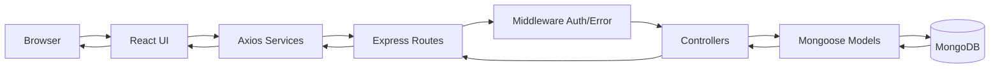
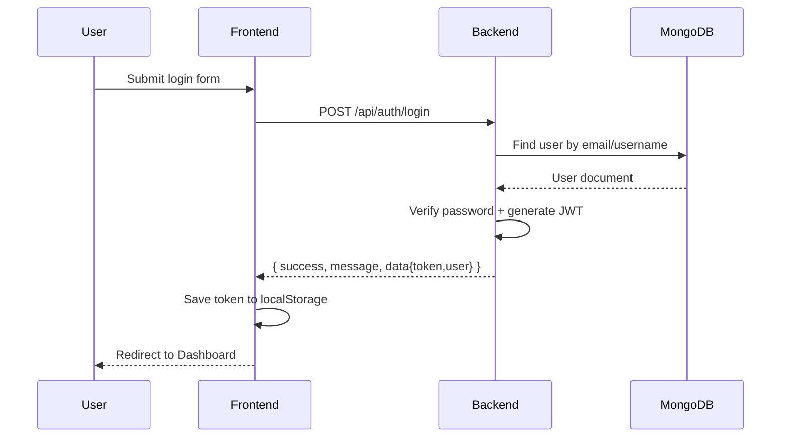
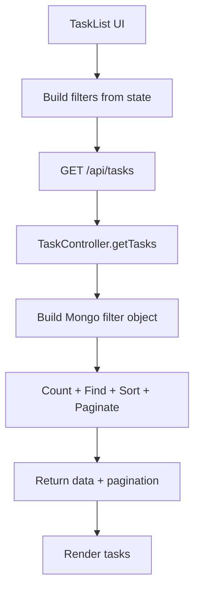

# TODO LIST - Do an cuoi ky Lap trinh Web Nang cao

Ung dung quan ly cong viec ca nhan theo kien truc MERN:
- MongoDB: luu tru du lieu
- Express + Node.js: cung cap REST API
- React: giao dien nguoi dung

Tai lieu nay da duoc cap nhat theo dung cau truc du an hien co trong workspace.

## 1) Tong quan he thong

He thong gom 3 lop chinh:

1. Frontend React o cong 3000 (dev) hoac Nginx cong 80/3000 (Docker)
2. Backend Express o cong 5000
3. MongoDB Atlas (khi chay local) hoac MongoDB container (khi chay Docker)

Luong tong quat:

```text
Trinh duyet -> React UI -> Axios -> Express API -> Mongoose -> MongoDB -> JSON response
      ^                                                                          |
      |                                                                          |
      --------------------------------------------------------------------------<
```

## 2) Cac tinh nang chinh

- Dang ky, dang nhap, xac thuc JWT
- Quan ly cong viec CRUD
- Danh muc cong viec theo user
- Priority, status, due date, tag
- Subtask va danh dau hoan thanh
- Tim kiem, loc, sap xep, phan trang
- Thong ke tong quan task
- Deadline alerts
- Weekly timetable
- Admin dashboard (thong ke toan he thong, quan tri user/task/category)

## 3) Huong dan chay web

## Cach A: Chay local

Yeu cau:
- Node.js >= 18
- npm
- MongoDB Atlas (hoac sua backend de tro sang local MongoDB)

Cai dat:

```bash
cd src/backend
npm install

cd ../frontend
npm install
```

Chay backend:

```bash
cd src/backend
npm start
```

Chay frontend:

```bash
cd src/frontend
npm start
```

Truy cap:
- Frontend: http://localhost:3000
- Backend API: http://localhost:5000

Tai khoan admin mac dinh (duoc tao/duy tri khi backend khoi dong):
- username: admin
- password: admin123

## Cach B: Chay bang Docker Compose

```bash
cd Docker
docker compose up --build
```

Them Mongo Express:

```bash
docker compose --profile dev up --build
```

Truy cap:
- App: http://localhost:3000
- Mongo Express: http://localhost:8081

## 4) Kiem chung tinh trang chay (da thuc hien)

Da kiem chung trong workspace ngay 2026-03-18:
- Backend ket noi MongoDB thanh cong va listen http://localhost:5000
- Frontend dev server compile thanh cong tai http://localhost:3000

## 5) Bug da fix trong lan cap nhat nay

### Loi da sua

Frontend xu ly sai payload cua API dang nhap/dang ky:
- Backend tra ve dang:
  - success
  - message
  - data: { user fields + token }
- AuthContext truoc day doc nham response.data.token thay vi response.data.data.token

### Tac dong

- Dang nhap thanh cong nhung localStorage co the luu sai du lieu
- Trang thai da dang nhap co the khong on dinh
- Phan quyen admin co the sai

### Cach da fix

Da dong bo parser trong AuthContext de lay dung object data tu response.

File da sua:
- src/frontend/src/context/AuthContext.js

## 6) Cau truc thu muc va giai thich

```text
.
├─ README.md
├─ THIET_KE_PIPELINE_VI.md
├─ Docker/
│  └─ docker-compose.yml
├─ scripts/
│  ├─ backup-database.sh
│  ├─ blue-green-deploy.sh
│  └─ rollback.sh
└─ src/
   ├─ backend/
   │  ├─ Dockerfile
   │  ├─ package.json
   │  ├─ server.js
   │  ├─ config/
   │  │  └─ database.js
   │  ├─ controllers/
   │  │  ├─ adminController.js
   │  │  ├─ authController.js
   │  │  ├─ categoryController.js
   │  │  └─ taskController.js
   │  ├─ middleware/
   │  │  ├─ authMiddleware.js
   │  │  └─ errorMiddleware.js
   │  ├─ models/
   │  │  ├─ Category.js
   │  │  ├─ Task.js
   │  │  └─ User.js
   │  └─ routes/
   │     ├─ adminRoutes.js
   │     ├─ authRoutes.js
   │     ├─ categoryRoutes.js
   │     └─ taskRoutes.js
   ├─ frontend/
   │  ├─ Dockerfile
   │  ├─ nginx.conf
   │  ├─ package.json
   │  ├─ build/
   │  ├─ public/
   │  └─ src/
   │     ├─ App.js
   │     ├─ App.css
   │     ├─ index.js
   │     ├─ index.css
   │     ├─ components/
   │     │  ├─ Auth/
   │     │  ├─ Layout/
   │     │  └─ Task/
   │     ├─ context/
   │     │  └─ AuthContext.js
   │     ├─ pages/
   │     │  ├─ AdminPage.js
   │     │  ├─ AuthPage.js
   │     │  └─ DashboardPage.js
   │     └─ services/
   │        ├─ adminService.js
   │        ├─ api.js
   │        ├─ authService.js
   │        ├─ categoryService.js
   │        └─ taskService.js
   └─ server/
      ├─ package.json
      ├─ start.bat
      └─ DB/
         ├─ database-schema.js
         └─ init-mongo.js
```

## Vai tro tung nhom thu muc

- src/backend:
  - Chua toan bo business logic va REST API
  - server.js la entrypoint backend
- src/frontend:
  - Chua toan bo giao dien React
  - services la lop giao tiep HTTP
  - context/AuthContext quan ly trang thai dang nhap
- src/server:
  - Script gom backend + frontend de chay nhanh tren may Windows
- Docker:
  - Cau hinh he thong container cho app
- scripts:
  - Script van hanh production (backup/deploy/rollback)

Luu y:
- Cac script trong scripts duoc viet theo boi canh server Linux production, can review truoc khi dung truc tiep.

## 7) Cach he thong hoat dong chi tiet

## 7.1 Luong dang nhap

1. User nhap thong tin o LoginForm
2. AuthContext goi authService.login
3. Axios gui POST /api/auth/login
4. Backend authController:
   - Tim user theo email/username
   - Kiem tra account active
   - So sanh password hash bang bcrypt
   - Tao JWT
5. Frontend luu token vao localStorage
6. Moi request tiep theo duoc api interceptor gan Authorization Bearer token

## 7.2 Luong task list

1. DashboardPage hien TaskList
2. TaskList goi taskService.getTasks voi bo loc
3. Backend taskController.getTasks tao object filter theo query
4. MongoDB truy van + sort + skip + limit
5. Ket qua tra ve gom data va pagination
6. UI render danh sach + cap nhat thong ke

## 7.3 Luong thong ke

1. Frontend goi /api/tasks/stats/overview
2. Backend chay Aggregation theo status, priority
3. Dem tong, overdues, completedToday
4. Tra ve object thong ke cho Sidebar va Dashboard

## 8) Phan tich thuat toan nghiep vu web

## 8.1 Xac thuc va bao mat

- Mat khau duoc hash truoc khi luu (bcrypt)
- Xac thuc phien dang nhap bang JWT
- Route rieng tu duoc bao ve bang middleware protect
- 401 se trigger co che logout tu dong o frontend

Do phuc tap:
- Login lookup user: trung binh O(1) neu co index email/username
- Verify password: O(cost bcrypt), phu thuoc work factor

## 8.2 Loc, tim kiem, sap xep task

Backend su dung:
- Filter dong theo status/priority/category
- Regex tim title khong phan biet hoa thuong
- Sort theo truong tuy chon
- Phan trang skip/limit

Do phuc tap xap xi:
- Loc co index: O(k) voi k la so ban ghi match
- Sort tren tap ket qua: O(k log k)
- Pagination skip/limit: O(skip + limit) tren mot so ke hoach query

Goi y toi uu khi du lieu lon:
- Them index tong hop cho (userId, status, priority, dueDate)
- Han che regex prefix khong co index
- Chuyen sang pagination cursor neu skip lon

## 8.3 Thong ke bang Aggregation Pipeline

Pipeline hien tai:
- match theo userId
- group theo status
- group theo priority
- count overdue, completedToday

Do phuc tap:
- O(n) tren tap task cua user

Uu diem:
- Tranh round-trip nhieu lan tu frontend
- Gom logic thong ke ve 1 endpoint

## 8.4 Deadline alert

Cach lam:
- Lay cac task co dueDate va chua complete/archive
- Tinh remainingMs
- Danh dau isOverdue
- Sort theo do gan deadline

Do phuc tap:
- Map O(n)
- Sort O(n log n)

Neu can toi uu:
- Day mot phan xu ly sang query voi condition dueDate near now
- Gioi han tap dau vao bang index dueDate

## 9) So do luong hoat dong (Mermaid)

## 9.1 End-to-end request flow



## 9.2 Login flow



## 9.3 Task query flow



## 10) Cac endpoint tieu bieu

Auth:
- POST /api/auth/register
- POST /api/auth/login
- GET /api/auth/me
- PUT /api/auth/profile

Tasks:
- GET /api/tasks
- POST /api/tasks
- GET /api/tasks/:id
- PUT /api/tasks/:id
- DELETE /api/tasks/:id
- GET /api/tasks/stats/overview
- GET /api/tasks/schedule/week
- GET /api/tasks/alerts/deadlines
- PUT /api/tasks/:id/subtasks/:subtaskId

Categories:
- GET /api/categories
- POST /api/categories
- PUT /api/categories/:id
- DELETE /api/categories/:id

Admin:
- GET /api/admin/overview
- GET /api/admin/users
- PUT /api/admin/users/:id/status
- POST /api/admin/users/:id/reset-password
- GET /api/admin/tasks
- DELETE /api/admin/tasks/:id
- GET /api/admin/categories
- POST /api/admin/categories
- PUT /api/admin/categories/:id
- DELETE /api/admin/categories/:id

## 11) Bien moi truong backend can co

Tao file src/backend/.env:

```env
PORT=5000
MONGODB_URI=<your_mongodb_uri>
JWT_SECRET=<your_secret>
JWT_EXPIRE=7d
NODE_ENV=development
ADMIN_USERNAME=admin
ADMIN_PASSWORD=admin123
ADMIN_EMAIL=admin@taskmanager.com
```

## 12) Ghi chu van hanh

- Frontend trong dev mode dang goi backend qua baseURL mac dinh http://localhost:5000/api
- Trong Docker, frontend build voi REACT_APP_API_URL=/api va Nginx proxy sang backend
- Neu backend mat ket noi MongoDB, server se dung ngay tu luc khoi dong de tranh loi am tham

---

Neu ban can, co the bo sung tiep cac phan sau trong README:
- So do ERD cho MongoDB collections
- Bang mapping route -> controller -> model
- Ke hoach test case cho tung endpoint
