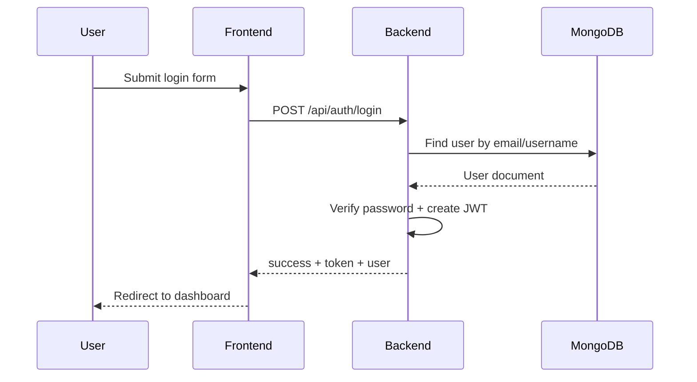
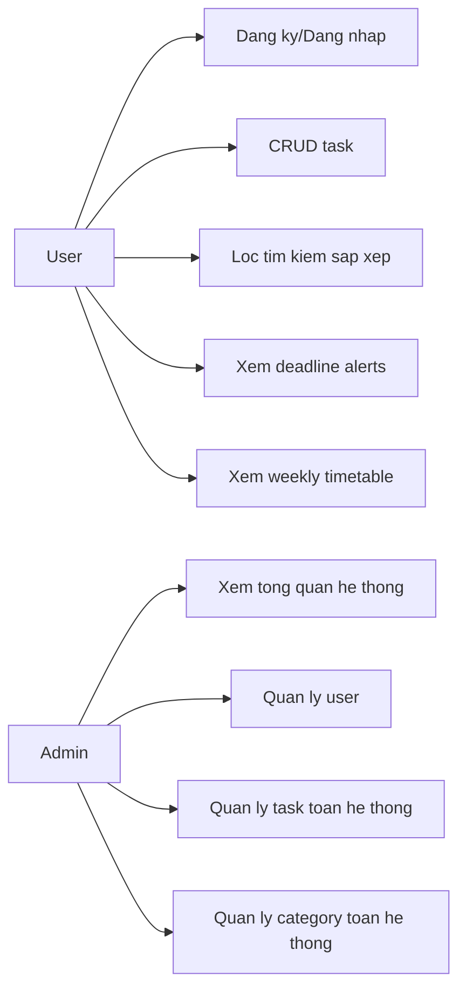

# Task Manager MERN - Do an cuoi ky Lap trinh Web Nang cao

Ung dung quan ly cong viec ca nhan theo kien truc MERN:
- MongoDB: luu tru du lieu
- Express + Node.js: REST API
- React: giao dien nguoi dung

README nay duoc viet lai de:
- De doc va de onboarding
- Dung voi cau truc thu muc hien tai
- Chay Docker dung path
- Co ro luong hoat dong, user diagram, va test case mau

## 1. Tong quan kien truc

He thong gom 3 thanh phan chinh:
1. Frontend React (nguoi dung thao tac tren trinh duyet)
2. Backend Express (xu ly nghiep vu, xac thuc, API)
3. MongoDB (luu user, task, category, thong ke)

Luong xu ly tong quat:

```text
Trinh duyet -> React UI -> Axios -> Express API -> Mongoose -> MongoDB
                                             <- JSON response <-
```

## 2) Cac tinh nang chinh

- Dang ky, dang nhap, xac thuc JWT
- Quan ly cong viec CRUD
- Danh muc cong viec theo user
- Priority, status, due date, tag
- Subtask va danh dau hoan thanh
- Tim kiem, loc, sap xep, phan trang
- Thong ke tong quan task
- Deadline alerts
- Weekly timetable
- Admin dashboard (thong ke toan he thong, quan tri user/task/category)

## 3) Huong dan chay web

## Cach A: Chay local

Yeu cau:
- Node.js >= 18
- npm
- MongoDB Atlas (hoac sua backend de tro sang local MongoDB)

Cai dat:

```bash
cd src/backend
npm install

cd ../frontend
npm install
```

Chay backend:

```bash
cd src/backend
npm start
```

Chay frontend:

```bash
cd src/frontend
npm start
```

Truy cap:
- Frontend: http://localhost:3000
- Backend API: http://localhost:5000

Tai khoan admin mac dinh (duoc tao/duy tri khi backend khoi dong):
- username: admin
- password: admin123

## Cach B: Chay bang Docker Compose

```bash
docker compose up --build
```

Them Mongo Express:

```bash
docker compose --profile dev up --build
```

Neu can file env mau cho Docker, su dung:

```bash
cp ops/.env.docker.example .env
```

Truy cap:
- App: http://localhost:3000
- Mongo Express: http://localhost:8081

## 4) Kiem chung tinh trang chay (da thuc hien)

Da kiem chung trong workspace ngay 2026-03-18:
- Backend ket noi MongoDB thanh cong va listen http://localhost:5000
- Frontend dev server compile thanh cong tai http://localhost:3000

## 5) Bug da fix trong lan cap nhat nay

### Loi da sua

Frontend xu ly sai payload cua API dang nhap/dang ky:
- Backend tra ve dang:
  - success
  - message
  - data: { user fields + token }
- AuthContext truoc day doc nham response.data.token thay vi response.data.data.token

### Tac dong

- Dang nhap thanh cong nhung localStorage co the luu sai du lieu
- Trang thai da dang nhap co the khong on dinh
- Phan quyen admin co the sai

### Cach da fix

Da dong bo parser trong AuthContext de lay dung object data tu response.

File da sua:
- src/frontend/src/context/AuthContext.js

## 6) Cau truc thu muc va giai thich

```text
.
├─ README.md
├─ package.json
├─ package-lock.json
├─ docker-compose.yml
├─ netlify.toml
├─ .env.example
├─ docs/
│  └─ THIET_KE_PIPELINE_VI.md
├─ ops/
│  ├─ .env.docker.example
│  ├─ mongodb/
│  │  ├─ database-schema.js
│  │  └─ init-mongo.js
│  └─ scripts/
│     ├─ backup-database.sh
│     ├─ blue-green-deploy.sh
│     └─ rollback.sh
└─ src/
   ├─ backend/
   │  ├─ Dockerfile
   │  ├─ package.json
   │  ├─ server.js
   │  ├─ config/
   │  ├─ controllers/
   │  ├─ middleware/
   │  ├─ models/
   │  └─ routes/
   ├─ frontend/
   │  ├─ Dockerfile
   │  ├─ nginx.conf
   │  ├─ package.json
   │  ├─ public/
    │  │  └─ _redirects
    │  ├─ build/
   │  └─ src/
   │     ├─ components/
   │     ├─ context/
   │     ├─ pages/
   │     └─ services/
```

Y nghia nhanh:
- src/backend: API va business logic
- src/frontend: giao dien va giao tiep API
- docker-compose.yml: cau hinh container cho mongodb, backend, frontend
- ops/mongodb: script khoi tao schema/index cho MongoDB
- ops/scripts: script van hanh production (backup/deploy/rollback)
- docs: tai lieu thiet ke va pipeline

## 3. Chay local (khong Docker)

Yeu cau:
- Node.js >= 18
- npm
- MongoDB Atlas hoac MongoDB local

### 3.1 Cai dependencies

```bash
cd src/backend
npm install

cd ../frontend
npm install
```

### 3.2 Tao env cho backend

Tao file src/backend/.env voi noi dung toi thieu:

```env
PORT=5000
MONGODB_URI=<your_mongodb_uri>
JWT_SECRET=<your_secret>
JWT_EXPIRE=7d
NODE_ENV=development
ADMIN_USERNAME=admin
ADMIN_PASSWORD=admin123
ADMIN_EMAIL=admin@taskmanager.com
```

### 3.3 Chay app

Terminal 1:
```bash
cd src/backend
npm start
```

Terminal 2:
```bash
cd src/frontend
npm start
```

Truy cap:
- Frontend: http://localhost:3000
- Backend: http://localhost:5000

## 4. Chay bang Docker

File compose nam o: docker-compose.yml (thu muc goc)

### 4.1 Chay nhanh

```bash
docker compose up --build
```

### 4.2 Chay kem Mongo Express (profile dev)

```bash
docker compose --profile dev up --build
```

Truy cap:
- App: http://localhost:3000
- Mongo Express: http://localhost:8081

### 4.3 Duong dan Docker da duoc chinh lai

Trong compose da cap nhat dung voi cau truc src hien tai:
- Backend build context: ./src/backend
- Frontend build context: ./src/frontend
- Mongo init script mount: ./ops/mongodb/init-mongo.js

## 4.4 Deploy Frontend len Netlify (khong bi 404)

Da them san 2 file de tranh loi "Page not found" khi refresh route:
- netlify.toml (build + publish + redirect)
- src/frontend/public/_redirects (SPA fallback)

Cau hinh Netlify de deploy frontend:
- Base directory: src/frontend
- Build command: npm run build
- Publish directory: build

Bien moi truong can set tren Netlify:
- REACT_APP_API_URL=https://<domain-backend-cua-ban>/api

Neu khong set REACT_APP_API_URL, frontend production se mac dinh goi /api tren cung domain.

### Khac phuc loi "dang nhap/dang ky luon that bai"

Neu tren Netlify ban thay dang nhap hoac dang ky luon that bai, thu tu kiem tra nhanh:
- Dam bao backend da deploy va truy cap duoc bang HTTPS.
- Trong Netlify, set `REACT_APP_API_URL=https://<domain-backend>/api`.
- Redeploy lai site sau khi sua env.
- Mo tab Network tren browser va kiem tra request `/auth/login`:
    - Neu URL dang la `https://<domain-netlify>/api/...` va tra ve HTML (`text/html`), nghia la frontend dang goi nham vao chinh Netlify site thay vi backend.

## 5. Luong hoat dong chi tiet

## 5.1 Login flow

1. User nhap tai khoan tai man hinh login
2. Frontend goi POST /api/auth/login
3. Backend kiem tra user + password hash
4. Backend tao JWT tra ve frontend
5. Frontend luu token va gan Authorization cho request tiep theo



## 5.2 Task management flow

1. User tao/sua/xoa task
2. Frontend goi API tasks
3. Backend validate quyen + du lieu
4. Backend ghi doc MongoDB
5. Frontend cap nhat UI + thong ke

```mermaid
flowchart TD
    A[User thao tac TaskForm/TaskList] --> B[Frontend services]
    B --> C[/api/tasks]
    C --> D[authMiddleware + taskController]
    D --> E[(MongoDB)]
    E --> D
    D --> B
    B --> F[Render lai danh sach task]
```

## 6. User diagram (vai tro va use case)



## 7. Endpoint chinh

Auth:
- POST /api/auth/register
- POST /api/auth/login
- GET /api/auth/me
- PUT /api/auth/profile

Task:
- GET /api/tasks
- POST /api/tasks
- GET /api/tasks/:id
- PUT /api/tasks/:id
- DELETE /api/tasks/:id
- GET /api/tasks/stats/overview
- GET /api/tasks/schedule/week
- GET /api/tasks/alerts/deadlines

Category:
- GET /api/categories
- POST /api/categories
- PUT /api/categories/:id
- DELETE /api/categories/:id

Admin:
- GET /api/admin/overview
- GET /api/admin/users
- PUT /api/admin/users/:id/status
- GET /api/admin/tasks
- DELETE /api/admin/tasks/:id

## 8. Test case mau

Bang duoi day la test case muc tieu de verify luong nghiep vu chinh.

| TC ID | Muc tieu | Input | Ket qua mong doi |
|---|---|---|---|
| TC-01 | Dang ky tai khoan moi | username/email/password hop le | 201, tao user thanh cong |
| TC-02 | Dang nhap dung | account hop le | 200, tra JWT token |
| TC-03 | Dang nhap sai mat khau | sai password | 401, thong bao sai thong tin |
| TC-04 | Tao task moi | token hop le + task data | 201, task duoc tao |
| TC-05 | Lay danh sach task theo filter | status=todo | 200, danh sach dung bo loc |
| TC-06 | Sua task | doi status -> completed | 200, task cap nhat thanh cong |
| TC-07 | Xoa task | task id hop le | 200, task bi xoa |
| TC-08 | Truy cap API khi khong co token | GET /api/tasks khong auth | 401 Unauthorized |
| TC-09 | User thu xem admin API | user token goi /api/admin/overview | 403 Forbidden |
| TC-10 | Admin khoa user | admin token + user id | 200, user bi khoa |
| TC-11 | Deadline alerts | co task sap den han | danh sach alerts dung thu tu deadline |
| TC-12 | Weekly schedule | co task trong tuan | du lieu timetable tra dung theo ngay |

## 9. Kiem thu nhanh sau khi khoi tao

Checklist smoke test:
1. Mo app va dang nhap bang admin mac dinh
2. Tao 1 task, sua status, xoa task
3. Tao 1 category moi
4. Kiem tra dashboard stats thay doi theo task
5. Neu la admin: vao trang admin xem overview

## 10. Tai khoan admin mac dinh

Backend se dam bao tai khoan admin mac dinh ton tai khi khoi dong:
- username: admin
- password: admin123

Nen doi thong tin nay trong moi truong production.

## 11. Ghi chu van hanh

- Frontend dev mode su dung proxy toi backend localhost:5000
- Docker frontend su dung nginx proxy /api -> backend:5000
- Neu backend khong ket noi duoc MongoDB, server se dung khi startup de tranh loi ngam

---

Neu ban muon, co the bo sung tiep:
- ERD chi tiet cho collections
- Mapping route -> controller -> model
- API contract cho tung endpoint (request/response)
