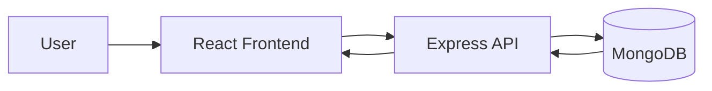
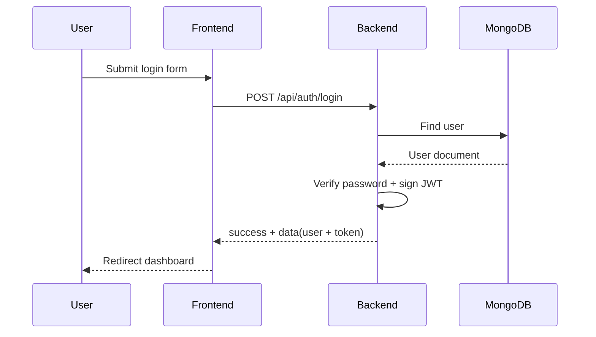

# 📌 Task Manager MERN - Báo cáo dự án Quản lý công việc

> **Nhóm thực hiện:** Đồ án cuối kì - Lập trình Web Nâng cao  
> **Mô hình:** MERN Stack (MongoDB, Express, React, Node.js)

---

## 📑 Mục lục
- [1. Giới thiệu tổng quan](#1-giới-thiệu-tổng-quan)
- [2. Kiến trúc hệ thống](#2-kiến-trúc-hệ-thống)
- [3. Tính năng chính](#3-tính-năng-chính)
- [4. Cài đặt và chạy chương trình](#4-cài-đặt-và-chạy-chương-trình)
- [5. Cấu trúc dự án](#5-cấu-trúc-dự-án)
- [6. Luồng hoạt động nghiệp vụ](#6-luồng-hoạt-động-nghiệp-vụ)
- [7. API chính](#7-api-chính)
- [8. Hướng dẫn triển khai](#8-hướng-dẫn-triển-khai)
- [9. Kiểm thử nhanh (Smoke Test)](#9-kiểm-thử-nhanh-smoke-test)
- [10. FAQ](#10-faq)
- [11. Đóng góp và phát triển](#11-đóng-góp-và-phát-triển)
- [12. Giấy phép](#12-giấy-phép)

---

## 1. Giới thiệu tổng quan

Đây là ứng dụng quản lý công việc cá nhân theo kiến trúc MERN, hỗ trợ:
- Quản lý task theo người dùng (CRUD)
- Danh mục công việc theo user
- Trạng thái, mức ưu tiên, deadline, tag
- Subtask và đánh dấu hoàn thành
- Dashboard thống kê và cảnh báo deadline
- Khu vực quản trị (admin) cho toàn hệ thống

Mục tiêu của tài liệu này:
- Giúp người đọc hiểu nhanh hệ thống
- Onboarding thuận tiện cho thành viên mới
- Cung cấp hướng dẫn chạy local, Docker và deploy

---

## 2. Kiến trúc hệ thống

Hệ thống gồm 3 lớp chính:
1. **Frontend (React):** giao diện và tương tác người dùng
2. **Backend (Express/Node.js):** xử lý nghiệp vụ, xác thực JWT, REST API
3. **Database (MongoDB):** lưu user, task, category

Luồng xử lý tổng quát:

```text
Browser -> React UI -> Axios -> Express API -> Mongoose -> MongoDB
                                           <- JSON response <-
```

Sơ đồ ngắn:



---

## 3. Tính năng chính

- Đăng ký, đăng nhập, xác thực JWT
- Cập nhật hồ sơ cá nhân
- CRUD công việc và danh mục
- Lọc/tìm kiếm/sắp xếp task
- Quản lý subtask
- Thống kê tổng quan công việc
- Weekly schedule
- Deadline alerts
- Admin dashboard:
  - Quản lý user
  - Quản lý task toàn hệ thống
  - Quản lý category toàn hệ thống

---

## 4. Cài đặt và chạy chương trình

### 4.1. Yêu cầu hệ thống
- Node.js >= 18
- npm
- MongoDB Atlas hoặc MongoDB local
- Docker (nếu chạy bằng Compose)

### 4.2. Chạy local (khuyến nghị cho phát triển)

Cài dependencies từ thư mục gốc:

```bash
npm run install-all
```

Chạy đồng thời backend + frontend:

```bash
npm run dev
```

Hoặc chạy riêng từng phần:

```bash
npm run backend
npm run frontend
```

Truy cập:
- Frontend: http://localhost:3000
- Backend: http://localhost:5000
- Health check backend: http://localhost:5000/health

### 4.3. Biến môi trường backend

Tạo file `src/backend/.env`:

```env
PORT=5000
MONGODB_URI=<your_mongodb_uri>
JWT_SECRET=<your_secret>
JWT_EXPIRE=7d
NODE_ENV=development
ADMIN_USERNAME=admin
ADMIN_PASSWORD=admin123
ADMIN_EMAIL=admin@taskmanager.com
```

Tài khoản admin mặc định sẽ được **đảm bảo tồn tại** khi backend khởi động:
- username: `admin`
- password: `admin123` (hoặc theo biến `ADMIN_PASSWORD`)

---

## 5. Cấu trúc dự án

```text
.
├─ README.md
├─ package.json
├─ netlify.toml
├─ render.yaml
├─ docker/
│  └─ docker-compose.yml
├─ docs/
│  └─ THIET_KE_PIPELINE_VI.md
├─ ops/
│  ├─ mongodb/
│  │  ├─ database-schema.js
│  │  └─ init-mongo.js
│  └─ scripts/
│     ├─ backup-database.sh
│     ├─ blue-green-deploy.sh
│     └─ rollback.sh
└─ src/
   ├─ backend/
   │  ├─ server.js
   │  ├─ config/
   │  ├─ controllers/
   │  ├─ middleware/
   │  ├─ models/
   │  └─ routes/
   └─ frontend/
      ├─ public/
      ├─ src/
      │  ├─ components/
      │  ├─ context/
      │  ├─ pages/
      │  └─ services/
      └─ build/
```

Giải thích nhanh:
- `src/backend`: API, business logic, auth, admin
- `src/frontend`: UI React, context xác thực, gọi API bằng Axios
- `docker/`: cấu hình chạy stack bằng Docker Compose
- `ops/`: script vận hành và khởi tạo MongoDB
- `docs/`: tài liệu thiết kế/pipeline

---

## 6. Luồng hoạt động nghiệp vụ

### 6.1. Đăng nhập



### 6.2. Quản lý task

```mermaid
flowchart TD
  A[User thao tác TaskForm/TaskList] --> B[Frontend services]
  B --> C[/api/tasks]
  C --> D[authMiddleware + taskController]
  D --> E[(MongoDB)]
  E --> D
  D --> B
  B --> F[Cập nhật UI và thống kê]
```

---

## 7. API chính

### 7.1. Auth
- `POST /api/auth/register`
- `POST /api/auth/login`
- `GET /api/auth/me`
- `PUT /api/auth/profile`

### 7.2. Task
- `GET /api/tasks`
- `POST /api/tasks`
- `GET /api/tasks/:id`
- `PUT /api/tasks/:id`
- `DELETE /api/tasks/:id`
- `PUT /api/tasks/:id/subtasks/:subtaskId`
- `GET /api/tasks/stats/overview`
- `GET /api/tasks/schedule/week`
- `GET /api/tasks/alerts/deadlines`

### 7.3. Category
- `GET /api/categories`
- `POST /api/categories`
- `PUT /api/categories/:id`
- `DELETE /api/categories/:id`

### 7.4. Admin
- `GET /api/admin/overview`
- `GET /api/admin/users`
- `PUT /api/admin/users/:id/status`
- `PUT /api/admin/users/:id/reset-password`
- `GET /api/admin/tasks`
- `DELETE /api/admin/tasks/:id`
- `GET /api/admin/categories`
- `POST /api/admin/categories`
- `PUT /api/admin/categories/:id`
- `DELETE /api/admin/categories/:id`

---

## 8. Hướng dẫn triển khai

### 8.1. Docker Compose

Chạy stack:

```bash
docker compose -f docker/docker-compose.yml up --build
```

Chạy nền:

```bash
npm run docker:up
```

Dừng stack:

```bash
npm run docker:down
```

Xem logs:

```bash
npm run docker:logs
```

Mở Mongo Express (profile dev):

```bash
docker compose -f docker/docker-compose.yml --profile dev up --build
```

Mặc định các container:
- `todo-list-01-db`
- `todo-list-02-api`
- `todo-list-03-web`
- `todo-list-04-db-admin` (khi bật profile dev)

### 8.2. Deploy Frontend lên Netlify

Đã có sẵn:
- `netlify.toml`
- `src/frontend/public/_redirects`

Cấu hình Netlify:
- Base directory: `src/frontend`
- Build command: `npm run build`
- Publish directory: `build`

Biến môi trường quan trọng:
- `REACT_APP_API_URL=https://<domain-backend>/api`

### 8.3. Deploy Backend lên Render

Đã có `render.yaml` để Render nhận diện service.

Biến bắt buộc cần cấu hình trên Render:
- `MONGODB_URI`
- `JWT_SECRET`
- `ADMIN_PASSWORD`

Kiểm tra sau deploy:
- `GET /health` trả về trạng thái `ok`

---

## 9. Kiểm thử nhanh (Smoke Test)

1. Đăng nhập bằng tài khoản admin mặc định
2. Tạo task mới, cập nhật trạng thái, xóa task
3. Tạo category mới
4. Kiểm tra dashboard stats thay đổi theo dữ liệu
5. Đăng nhập bằng tài khoản thường và thử truy cập API admin (phải bị chặn)

Mẫu test case nghiệp vụ:
- Đăng ký thành công với user mới
- Đăng nhập sai mật khẩu trả về 401
- Gọi API bảo vệ khi không có token trả về 401
- User thường gọi `/api/admin/*` trả về 403

---

## 10. FAQ

**1) Vì sao frontend production có thể đăng nhập thất bại trên Netlify?**  
Thường do thiếu `REACT_APP_API_URL`, khiến frontend gọi sai domain API.

**2) Vì sao backend dừng ngay khi khởi động?**  
Nếu `MONGODB_URI` sai hoặc MongoDB không truy cập được, backend sẽ thoát để tránh chạy lỗi ngầm.

**3) Có bắt buộc dùng Docker không?**  
Không. Có thể chạy local bằng `npm run dev` từ thư mục gốc.

**4) Vai trò admin được tạo như thế nào?**  
Backend tự đảm bảo tài khoản admin tồn tại khi khởi động, theo biến `ADMIN_*`.

---

## 11. Đóng góp và phát triển

Hướng mở rộng đề xuất:
- Realtime notifications (WebSocket)
- Nhắc việc định kỳ qua email/cron
- Tối ưu phân trang và truy vấn thống kê lớn
- Bổ sung unit test/integration test
- Bổ sung OpenAPI/Swagger cho tài liệu API

---

## 12. Giấy phép

Xem file giấy phép tại `LICENSE.md`.
